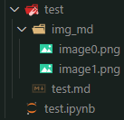
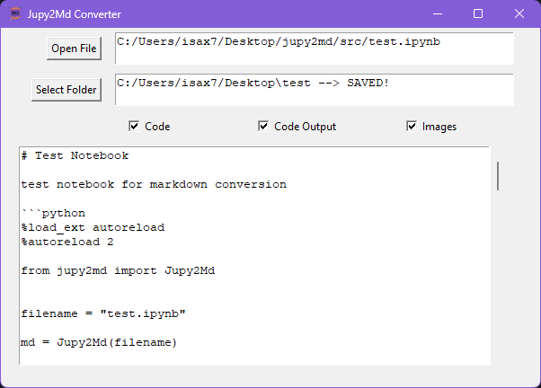

# Readme

A lightweight tool for converting Jupyter Notebooks (`JN`) into Markdown (`MD`) format, images included. The converted notebook is located into a folder named as it is. Such a folder contains the `.md` file and the `img_md` subfolder with all the images contained into the `JN`, as shown below:



The conversion is carried out by the `Jupy2Md` class that has three different usages:

1. imported into a Python script;
2. called by the dedicated GUI here provided;
3. run by Python via command line.

---

**Index**
- [Readme](#readme)
- [`Jupy2Md` Class](#jupy2md-class)
- [GUI](#gui)
- [Command Line](#command-line)

---

# `Jupy2Md` Class

The class importing, converting, and exporting the `JN` file.

- `__init__(self, filepath:str, settings:dict={})`: initialization of the class and conversion based on the provided settings.

```python
    def __init__(self, filepath:str, settings={}):
        """
        - filepath: str, path of the .ipynb to be converted
        - settings: dict, default={}
            - "md_text": bool, default=True, markdown text
            - "md_images": bool, default=True, images within markdown
            - "code": bool, default=True, code blocks
            - "code_output": bool, default=True, code printout
            - "code_text": bool, default=True, code text
            - "code_images": bool, default=True, code images 
            - "export": bool, default=False, export (save) file and img
            - "export_folder": str, default=None, export folder
        """
```
- `def convert_to_md(self)`: the whole conversion happens here!

# GUI



The GUI is a single window that includes and instance of `Jupy2Md` class. Such instance, named `.jupy2md`, is initialized as `None` when the GUI is started:

```python
class MainWindow:
    def __init__(self):
        self.jupy2md = None
        ...
```

Functionalities:

- first file selection or select new one: `self.jupy2md=Jupy2Md(filepath, settings)`
- any checkbox check runs the conversion (`self.jupy2md.convert_to_md(settings)`)
- save -> `self.jupy2md.export(folder)`

Flags (i.e. checkboxes) including/excluding parts of the `JN`:

- `Code`: codeblocks;
- `Code Output`: code printouts;
- `Images`: images, both within markdown and code printout (e.g. plots).

By default all the flags are enabled.

# Command Line

The script converts the provided `JN` by exporting the `MD` (and the related images) into the same directory of the `JN`. No flags can be set (for the moment) so the full `JN` will be converted, i.e. images, codeblocks, printouts included.

Command:

```shell
  python path/to/jupy2md.py jupyter/notebook/path.ipynb
```

The command can run from anywhere. It follows that the `jupy2md.py` file has to be properly located and provided with its complete relative path.

The `JN` filepath can be both *absolute* and *relative*.