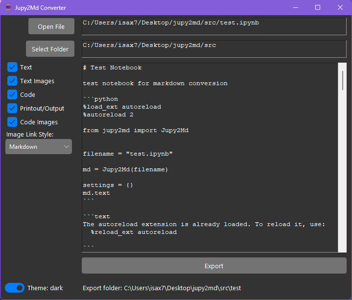
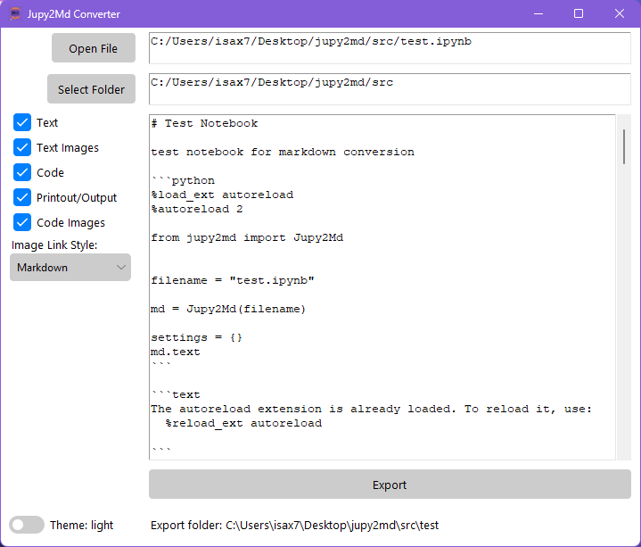

# Readme

A lightweight tool for converting Jupyter Notebooks (`JN`) into Markdown (`MD`) format, images included. 



The converted notebook is located into a folder named as it is. Such a folder contains the `.md` file and the `img_md` subfolder with all the images contained into the `JN`, as shown below:


The conversion is carried out by the `Jupy2Md` class that has three different usages:

1. imported into a Python script;
2. called by the dedicated GUI here provided;
3. run by Python via command line.

---

**Index**
- [Readme](#readme)
- [`Jupy2Md` Class](#jupy2md-class)
- [GUI](#gui)
- [Command Line](#command-line)
- [Credits](#credits)

---

# `Jupy2Md` Class

The class importing, converting, and exporting the `JN` file. 

When instantiating the class, the conversion is done directly on the basis of the initialization settings, i.e. `settings` dictionary.

Once intantiated, the conevrsion can be repeated by executing the `.convert_to_md` method with new `settings` parameters.

Main methods:

- `def __init__(self, filepath:str, settings={})`: initialization and conversion.

```text
    - filepath: str, path of the .ipynb to be converted
    - settings: dict, default={}
```
- `def convert_to_md(self, settings=None)`: the whole conversion happens here!

```text
    - settings: dict, default=None
```
- `def export_md(self, export_folder=None)`: export the markdown file into the selected folder (conversion needed before export):

```text
    - export_folder: str, default=None
```

The dictionary `settings` of both methods allows defining the conversion options and accepts the following arguments:

```text
    - "md_text": bool, default=True, markdown text
    - "md_images": bool, default=True, images within markdown
    - "code": bool, default=True, code blocks
    - "code_output": bool, default=True, code printout
    - "code_text": bool, default=True, code text
    - "code_images": bool, default=True, code images 
    - "export": bool, default=False, export (save) file and img
    - "export_folder": str, default=None, export folder
```

# GUI

The GUI is a single window that includes and instance of `Jupy2Md` class. Such instance, named `.jupy2md`, is initialized as `None` when the GUI is started:

```python
class MainWindow:
    def __init__(self):
        self.jupy2md = None
        ...
```

Functionalities:

- Import of `JN` from local folders;
- Dynamic conversion: by checking any checkbox the conversion runs;
- Automated export of `.md` file and related images.

Flags (i.e. checkboxes) including/excluding parts of the `JN`:

- `Text`: markdown text;
- `Text Images`: images within the markdown text;
- `Code`: codeblocks;
- `Printout/Output`: code printouts;
- `Code Images`: images generated by the code (e.g. plots).

By default all the flags are enabled.

*Light theme* is also available, can be easily enabled by toggling the swithc on the bottom left corner of the window:



# Command Line

The script converts the provided `JN` by exporting the `MD` (and the related images) into the same directory of the `JN`. No flags can be set (for the moment) so the full `JN` will be converted, i.e. images, codeblocks, printouts included.

Command:

```shell
  python path/to/jupy2md.py jupyter/notebook/path.ipynb
```

The command can run from anywhere. It follows that the `jupy2md.py` file has to be properly located and provided with its complete relative path.

The `JN` filepath can be both *absolute* and *relative*.

# Credits

Many thanks to [oldium](https://github.com/oldium) for the amazing [Azure Theme](https://github.com/rdbende/Azure-ttk-theme).